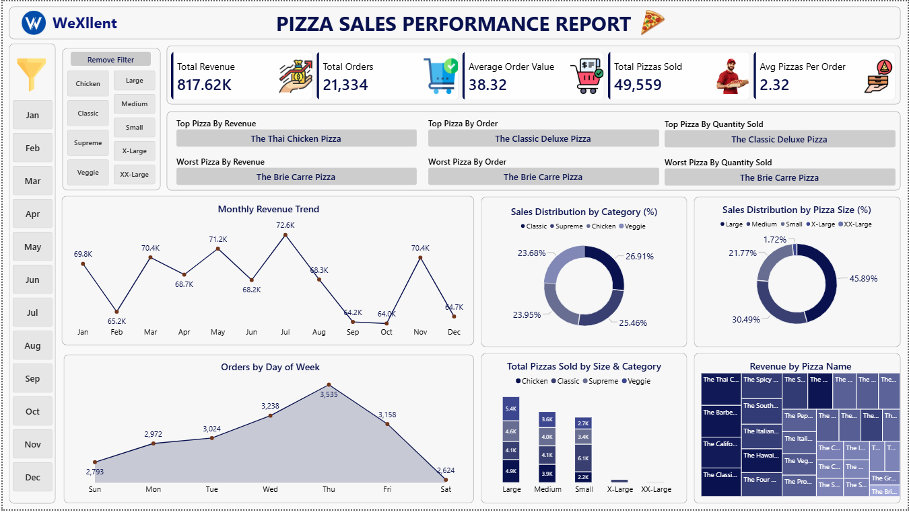

# 🍕 Pizza Sales Performance Dashboard | PostgreSQL & Power BI

## Project Overview

This project presents an end-to-end Pizza Sales Analysis solution developed using PostgreSQL and Power BI.

The objective of this project is to analyze pizza sales performance, customer ordering behavior, product demand, and revenue trends to generate actionable business insights. PostgreSQL was used for data analysis and business query generation, while Power BI was used to create an interactive dashboard for decision-making.

---

## Dashboard Preview

---

## Business Problem

Restaurant businesses generate large volumes of transactional data daily. Without proper analysis, identifying sales trends, customer preferences, and revenue-driving products becomes challenging.

This dashboard helps answer critical business questions such as:

- Which pizzas generate the highest revenue?
- Which pizza category performs best?
- Which pizza size contributes the most sales?
- How do monthly sales trends vary throughout the year?
- What are the busiest ordering days?
- Which products require business attention due to low sales?

---

## Key Performance Indicators (KPIs)

| KPI | Value |
|------|--------|
| Total Revenue | $817.86K |
| Total Orders | 21,334 |
| Average Order Value | $38.32 |
| Total Pizzas Sold | 49,559 |
| Average Pizzas Per Order | 2.32 |

---

## Dashboard Features

### Executive KPI Summary
- Total Revenue
- Total Orders
- Average Order Value
- Total Pizzas Sold
- Average Pizzas Per Order

### Product Performance Analysis
- Top Pizza by Revenue
- Top Pizza by Orders
- Top Pizza by Quantity Sold
- Worst Performing Pizza Analysis

### Sales Trend Analysis
- Monthly Revenue Trend
- Orders by Day of Week

### Category Analysis
- Sales Distribution by Pizza Category
- Sales Distribution by Pizza Size

### Product Insights
- Total Pizzas Sold by Category & Size
- Revenue Contribution by Pizza Name

### Interactive Filters
- Month Filter
- Pizza Category Filter
- Pizza Size Filter

---

## Tools & Technologies Used

### PostgreSQL
- Data Validation
- KPI Calculations
- Business Analysis Queries
- Aggregations and Reporting

### Power BI
- DAX Measures
- Interactive Dashboard Design
- Data Visualization
- KPI Reporting

---

## SQL Analysis Performed

The following business questions were answered using PostgreSQL:

1. Total Revenue Generated
2. Total Orders Placed
3. Average Order Value
4. Total Pizzas Sold
5. Average Pizzas Per Order
6. Best Selling Pizza
7. Lowest Selling Pizza
8. Revenue by Pizza Category
9. Revenue by Pizza Size
10. Monthly Revenue Trend
11. Daily Order Analysis

---

## Key Business Insights

- Large-size pizzas contribute the highest percentage of overall sales.
- The Classic Deluxe Pizza generates the highest number of orders and quantity sold.
- The Thai Chicken Pizza generates the highest revenue.
- Revenue peaks during July and November.
- Thursday records the highest order volume among all weekdays.
- Certain pizza products contribute very little revenue and may require menu optimization.

---

## Skills Demonstrated

- PostgreSQL
- SQL Query Writing
- Data Cleaning
- Data Analysis
- Business Intelligence
- Power BI
- DAX
- Data Visualization
- Dashboard Design
- KPI Development

---

## How to Use

1. Download the dataset.
2. Import data into PostgreSQL.
3. Execute SQL queries for business analysis.
4. Connect Power BI to PostgreSQL.
5. Build data model and DAX measures.
6. Explore the interactive dashboard.

---

## Author

### Shakthi Sharma

Data Analyst | Power BI Developer | SQL Developer | Content Creator

Skilled in:
- PostgreSQL
- Power BI
- SQL
- Excel
- Data Visualization
- Business Analytics

Thank you for visiting this project repository.
